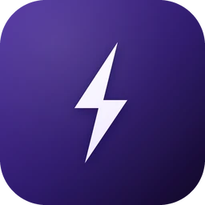
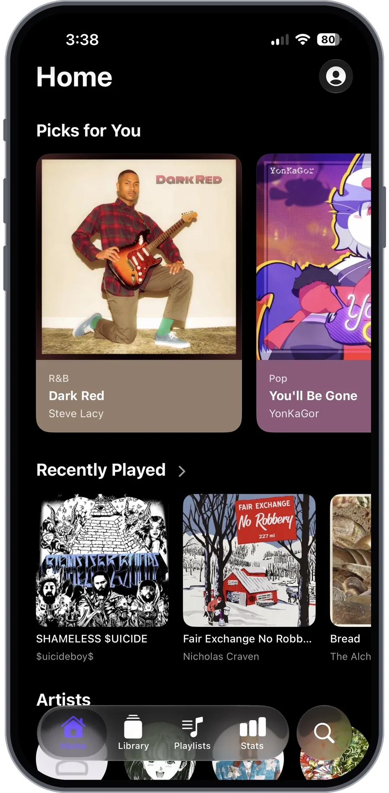
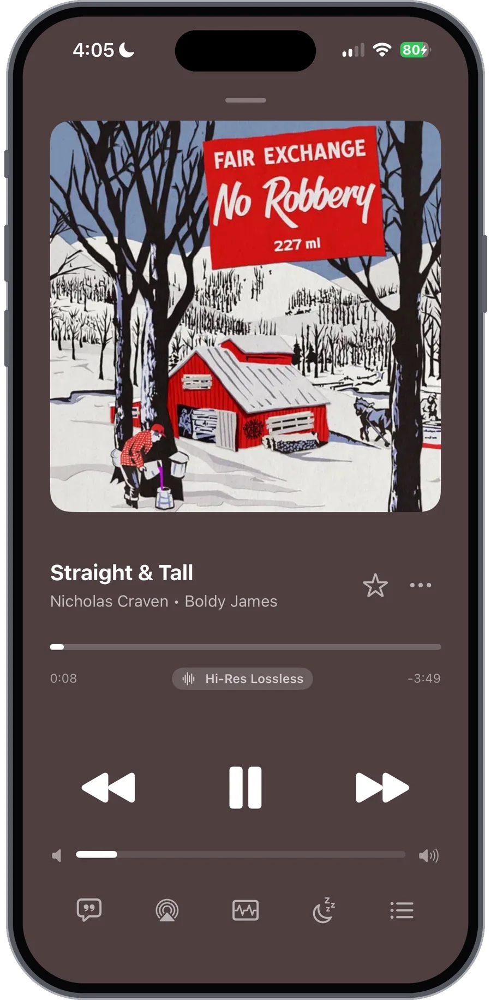
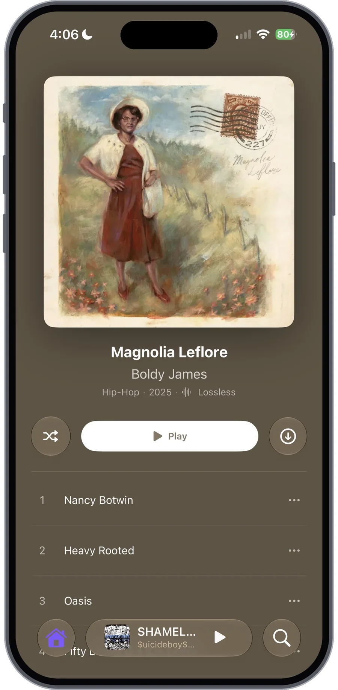
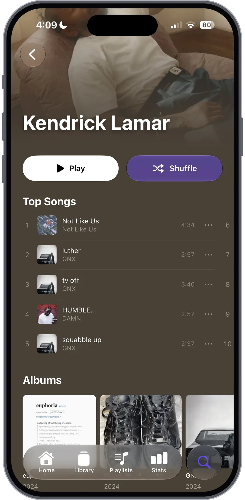
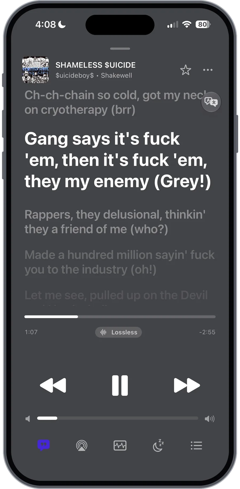
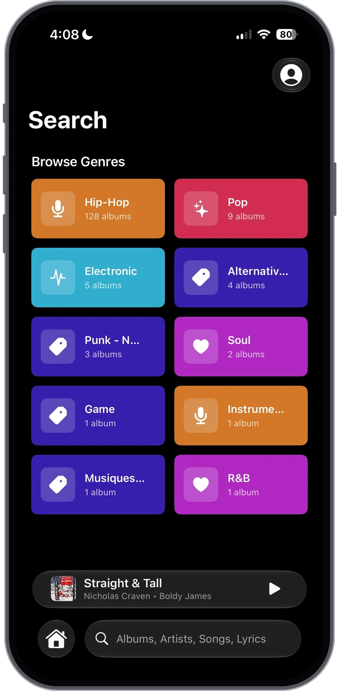

<div align="center">



# Volta

**A native iOS player for your own music server Subsonic, Jellyfin, Emby, or Plex.**


[](LICENSE)

</div>

---

<div align="center">

<table>
  <tr>
    <td align="center"><br><sub><b>Home</b> · Picks for You & Recently Played</sub></td>
    <td align="center"><br><sub><b>Now Playing</b> · artwork-tinted player</sub></td>
    <td align="center"><br><sub><b>Album</b> · shuffle / play / download</sub></td>
  </tr>
  <tr>
    <td align="center"><br><sub><b>Artist</b> · stretchy header & top songs</sub></td>
    <td align="center"><br><sub><b>Synced Lyrics</b> · tap to seek, translate</sub></td>
    <td align="center"><br><sub><b>Search</b> · browse genres & lyrics</sub></td>
  </tr>
</table>

</div>

## Features

- **Playback** Gapless and crossfade, plus an AutoMix mode that (tries to) beat-match tracks. ReplayGain, a sleep timer, and an infinite autoplay queue. Full lock screen, Control Center, and (WIP) Siri support.
 
- **Audio** A 10-band graphic EQ, mono downmix, a 3D spatial widener, and an Audio Signal Path sheet so you can see exactly what's happening to the sound. Lossless / Hi-Res / True Hi-Res badges come from real format data, not guesses.

- **Now Playing** Backgrounds that take their colour from the artwork, animated cover art (GIF, APNG, WebP) on screen *and* the lock screen, a built-in visualiser, and an output icon that changes to match your AirPods / car / speakers.

- **Lyrics** Time-synced lyrics (via [LRCLIB](https://lrclib.net)) with tap-to-seek, on-device translation, bulk download for offline use, and search across the lyrics you've saved.

- **Library** A Home feed with daily Picks for You, Discovery Station, Heavy Rotation, and genre/artist mixes. Albums, artists, songs, genres, folders, playlists, smart playlists, and hidden albums.

- **Offline** Multithreaded, resumable downloads with per-track progress, a storage cap that auto-evicts your least-played downloads, and artist profiles that still work with no connection.

- **Multi-server** Save several servers and switch between them on the fly (touch-and-hold to remove one). Each server can have its own cellular URL that kicks in automatically off Wi-Fi. No server? Try a built-in demo.

- **Localized** 17 languages with live, in-app switching.

- **Lightweight** It sits at roughly **30 MB of RAM** idle on the Home tab (more on that below).

## Performance

Volta sizes itself to the device it reads the physical RAM tier (3 / 4 / 6 / 8 GB+) and scales every cache and decode budget to match, then leans on disk so very little has to stay in memory.

- RAM-tiered artwork cache (**48 → 128 MB**) and animated-frame decode caps (**192 → 768 px**)
- Images are never decoded larger than the device's screen
- Animated artwork runs off one shared frame-stepper with a downsampled on-disk frame cache, and caches get evicted on memory pressure
- Scroll and drag are throttled to the display refresh, with `CADisplayLink` keeping frame pacing steady
- An optional **Performance Mode** (battery saver) plus **Image Loading** and **Data Caching** dials if you want to trade quality for battery

Volta tries it's best to be as lightweight as possible constainly, in testing it uses this much ram for the following

- Idle on home tab - about ~30MB of ram
- Viewing a album (static artwork) - ~40MB of ram (with music playing ~50MB of ram)
- Viewing a artist (15+ albums) - ~60MB of ram (with music playing ~70MB)
- Viewing a album with animated artwork - ~170MB of ram (pre-optimizations ~2.3GB of ram)

## Supported servers

| Backend | Notes |
| --- | --- |
| **Subsonic / OpenSubsonic** | [Navidrome](https://navidrome.org) (volta works best with), Gonic, Airsonic, Funkwhale, and friends |
| **Jellyfin / Emby** | Self-hosted [Jellyfin](https://jellyfin.org) or Emby |
| **Plex** | Plex Media Server, with hosted "Sign in with Plex" |

## Getting started

Volta needs a music server to talk to. On first launch, pick your server type, drop in the URL and your login (plain `http` is allowed), and your library loads in.

## Building from source

There's no App Store build yet, so for now you build it yourself with [xtool](https://github.com/xtool-org/xtool) on **Linux, Windows (WSL), and macOS**:

```bash
xtool devices                       # list connected iPhones and their UDIDs
xtool dev run --udid <DEVICE_UDID>  # build, install, and launch on device
```

## Contributing

Issues, ideas, and pull requests are all welcome this is a personal project and I'm happy to have company. If you're reporting a bug, mentioning your server type (Navidrome, Jellyfin, Plex…) and iOS version helps a lot.

## Acknowledgements

- [xtool](https://github.com/xtool-org/xtool) building and deploying to iOS without a Mac
- [LRCLIB](https://lrclib.net) community-sourced synced lyrics
- The [Subsonic](https://www.subsonic.org/pages/api.jsp) / OpenSubsonic, [Jellyfin](https://jellyfin.org), and Plex APIs that make any of this possible

## License

Volta is released under the [GNU General Public License v3.0](LICENSE) the same strong-copyleft licence used by [Amperfy](https://github.com/BLeeEZ/amperfy), [Supersonic](https://github.com/dweymouth/supersonic), and [Feishin](https://github.com/jeffvli/feishin). You're free to use, study, share, and modify it; any distributed derivative has to stay open-source under the GPLv3 too.
